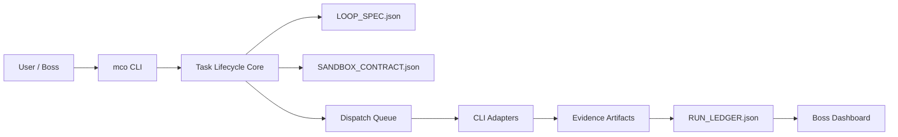

# Architecture

```mermaid
flowchart LR
  User["User / Boss"] --> CLI["mco CLI"]
  CLI --> Task["Task Lifecycle Core"]
  Task --> Loop["LOOP_SPEC.json"]
  Task --> Sandbox["SANDBOX_CONTRACT.json"]
  Task --> Dispatch["Dispatch Queue"]
  Dispatch --> Adapter["CLI Adapters"]
  Adapter --> Evidence["Evidence Artifacts"]
  Evidence --> Ledger["RUN_LEDGER.json"]
  Ledger --> Dashboard["Boss Dashboard"]
```

The core runtime should stay local-first and adapter-neutral.

