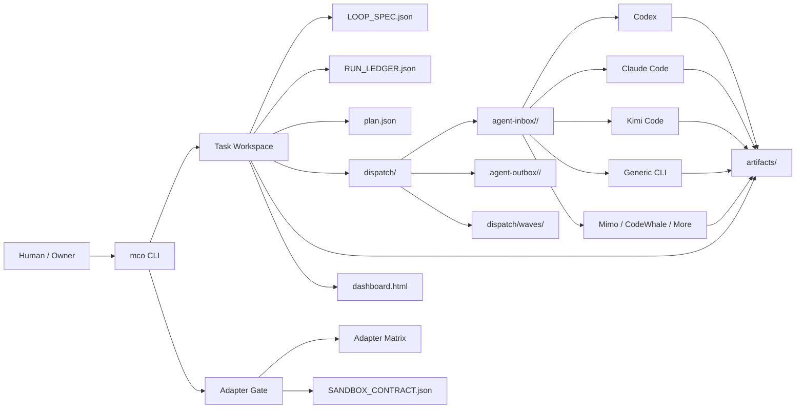

# Multi-CLI Orchestrator 项目设计说明 v4.0

> Local-first Agent OS for coordinating multiple AI coding CLIs as supervised workstations.

Multi-CLI Orchestrator 是一个本地优先的多 CLI 协作控制平面。它不试图替代 Codex、Claude Code、Kimi Code、Mimo Code、CodeWhale 这些工具，而是把它们抽象成可监管的“工位”：每个工位有能力边界、沙箱契约、任务收件箱、执行证据、状态门禁和可回放运行记录。

项目主页：[github.com/god0618-cloud/multi-cli-orchestrator](https://github.com/god0618-cloud/multi-cli-orchestrator)

当前版本：`v4.0.0`  
当前定位：开源 MVP，可公开 clone、可运行、可演示、可二次开发。  
核心新增：`mco dispatch wave`，支持有界多 worker 派棒，但仍保持 adapter gate、安全边界和证据闭环。

---

## 1. 项目定位

### 一句话说明

Multi-CLI Orchestrator 让多个 AI Coding CLI 像一个受监管的小团队一样工作：任务可以被拆分、派发、执行、审计、回放，而不是散落在多个聊天窗口里。

### 面向谁

| 用户 | 典型痛点 | 本项目提供的价值 |
| --- | --- | --- |
| 高频使用 AI CLI 的个人开发者 | 多个 CLI 各自有记忆、上下文、额度和输出，任务容易散 | 统一任务目录、运行账本、证据产物和状态面板 |
| 想让不同模型共同参与复杂任务的人 | 单一 CLI 的 subagent 仍在同一模型/运行时边界里 | 把不同 CLI 当作不同“工位”，保留各自模型差异 |
| 小团队/独立开发者 | AI 协作过程不可追踪，交接靠复制粘贴 | dispatch inbox、handoff、artifact、audit 构成协作链 |
| 开源贡献者 | 新 CLI 接入容易“先声称可用，后补证据” | disabled-by-default adapter kit + validate-kit + smoke gate |

---

## 2. 为什么不是“再做一个 Agent 框架”

很多 agent 框架强调“一个主 agent 调度多个 subagent”。这个思路有价值，但它通常仍处在同一个模型供应商、同一个运行时或同一个工具权限域里。

Multi-CLI Orchestrator 的核心假设不同：

1. **CLI 是工位，不是子进程**
   每个 CLI 有自己的模型、认证、上下文习惯、工具链和成本结构。它们应该被当作独立工作站接入，而不是被抹平成一个通用 worker。

2. **控制平面应该独立于任一 CLI**
   任务状态、门禁、证据、运行记录不应该只存在某一个 CLI 的聊天上下文里。否则换一个会话、换一个模型，协作链就断了。

3. **协作不是“无限自动跑”，而是“有界闭环”**
   自动化的关键不是让 agent 永远运行，而是让每个最小闭环单元有清晰输入、负责人、输出、验收标准、失败状态和升级路径。

4. **先证据，后记忆**
   不直接污染稳定知识库或 CLI 原生记忆。先把事实写进任务 artifact 和 `RUN_LEDGER.json`，再决定哪些经验值得沉淀。

---

## 3. 核心设计原则

| 原则 | 设计含义 | 体现 |
| --- | --- | --- |
| Local-first | 默认在本机文件系统工作，不依赖云端数据库 | `.mco` workspace、task dir、static dashboard |
| Evidence-first | 每次任务推进都留下可检查证据 | `RUN_LEDGER.json`、artifact register、audit |
| Gate-first | 没有通过门禁，不自动进入下一阶段 | workflow advance、adapter gate、release check |
| Disabled-by-default | 新 CLI 接入先禁用，证明后再启用 | adapter scaffold、validate-kit、smoke checklist |
| Bounded automation | 自动化必须有次数、时间、worker 数量等边界 | monitor cycles、dispatch wave max 6 workers |
| Human-visible | 用户要能看到谁在干活、哪里卡住、是否需要拍板 | boss dashboard、status、matrix、LIVE_STATE 类视图 |

---

## 4. 系统架构



### 核心对象

| 对象 | 作用 |
| --- | --- |
| Workspace | 本地控制平面根目录，保存配置和任务 |
| Task | 一个复杂任务的最小治理单元 |
| LOOP_SPEC | 任务循环规则、阶段、门禁和停止条件 |
| RUN_LEDGER | 事件账本，记录发生过什么 |
| Dispatch | 给某个 CLI 工位的一棒任务 |
| Dispatch Wave | 一次有界多工位派发，最多 6 个 worker |
| Adapter Manifest | 某个 CLI 能力声明 |
| Sandbox Contract | 某个工位的读写范围、凭证策略、验证产物 |
| Artifact | 任务产出的证据文件 |
| Dashboard | 老板视角的静态状态页面 |

---

## 5. v4.0 已实现能力

### 5.1 工作区和任务

```bash
mco init --workspace .mco-workspace
mco task create "Build a mobile-first project page" --workspace .mco-workspace
mco task list --workspace .mco-workspace
mco task status <task_id> --workspace .mco-workspace
```

每个任务都会生成：

- `task.json`
- `LOOP_SPEC.json`
- `RUN_LEDGER.json`
- `dispatch/`
- `artifacts/`

### 5.2 单 worker 派棒

```bash
mco dispatch queue <task_id> \
  --agent kimi-code \
  --title "Frontend pass" \
  --instructions "Polish mobile UI" \
  --require-ready \
  --workspace .mco-workspace
```

如果 adapter 不是 `READY_SUPERVISED`，任务不会进入该 agent 的 inbox，而是写成 blocked dispatch evidence。

### 5.3 多 worker wave 派棒

v4.0 的核心新增能力：

```bash
mco dispatch wave <task_id> --spec wave.json --require-ready --workspace .mco-workspace
```

示例 `wave.json`：

```json
{
  "title": "Sprint review wave",
  "workers": [
    {
      "agent": "generic-cli",
      "title": "API drift review",
      "instructions": "Check API contract drift and report evidence."
    },
    {
      "agent": "kimi-code",
      "title": "Frontend polish review",
      "instructions": "Review mobile UI fit and report findings."
    }
  ]
}
```

设计边界：

- 一个 wave 最多 6 个 workers。
- 每个 worker 仍走普通 dispatch queue。
- `--require-ready` 会逐个检查 adapter readiness。
- blocked worker 不会收到 inbox 文件。
- wave manifest 写入 `dispatch/waves/`，便于审计和回放。

### 5.4 Adapter Matrix

```bash
mco adapter matrix --doctor --output adapter-matrix.json --html adapter-matrix.html
```

它回答三个问题：

1. 这个 CLI 是否已经实现 adapter？
2. 它是否可以非交互式、有监督地执行？
3. 它是否有 quota / smoke / sandbox 等晋升证据？

### 5.5 Boss Dashboard

```bash
mco dashboard <task_id> --workspace .mco-workspace
```

Dashboard 面向“老板视角”：

- 当前任务状态
- dispatch 状态
- adapter readiness
- usage snapshot
- artifact 列表
- timeline / replay
- blocked / failed escalation

### 5.6 Replay

```bash
mco run replay <path-to-RUN_LEDGER.json>
mco run replay <path-to-RUN_LEDGER.json> --html replay.html
```

Replay 的价值是：任务结束后，不需要翻聊天记录，也能知道任务怎样推进、哪里被阻断、产物在哪里。

### 5.7 Adapter Contributor Kit

```bash
mco adapter scaffold kimi-code --output-dir adapter-kits/kimi-code
mco adapter validate-kit adapter-kits/kimi-code
```

新 adapter 必须先以 disabled-by-default 的方式进入项目，再通过 manifest、sandbox、fixture、contract test、smoke evidence 逐步晋升。

---

## 6. 演示主线

### 演示目标

让观众看到：这不是一个“聊天提示词合集”，而是一套可以被 clone、运行、审计、扩展的多 CLI 协作基础设施。

### 建议演示脚本

#### Step 1：展示项目定位

打开 GitHub README，先讲：

> 我们不是再造一个 Agent，而是把多个 AI Coding CLI 抽象成受监管的工位。控制平面负责任务、门禁、证据和回放；具体干活的 CLI 仍然保留自己的模型和工具生态。

#### Step 2：初始化工作区

```bash
mco init --workspace .mco-demo
mco doctor --workspace .mco-demo
```

讲解点：

- 本地优先。
- 没有云数据库。
- 先有 workspace，再有任务和证据。

#### Step 3：创建任务

```bash
mco task create "Demo multi-worker review" --json --workspace .mco-demo
```

讲解点：

- 每个复杂任务都有自己的任务目录。
- 不是靠聊天上下文记忆任务状态。

#### Step 4：展示 adapter matrix

```bash
mco adapter matrix --doctor --output adapter-matrix.json --html adapter-matrix.html
```

讲解点：

- 不假装所有 CLI 都能自动干活。
- 没准备好的 adapter 只会显示 disabled / blocked。
- 这解决了“什么都能做”的幻觉。

#### Step 5：跑 dispatch wave

```bash
mco dispatch wave <task_id> --spec wave.json --require-ready --workspace .mco-demo
```

讲解点：

- 多 worker 派棒不是自由散射，而是有上限、有门禁、有证据。
- READY 的进入 inbox。
- 不 READY 的写 blocked evidence。

#### Step 6：打开 Dashboard / Replay

```bash
mco dashboard <task_id> --workspace .mco-demo
mco run replay .mco-demo/tasks/<task_id>/RUN_LEDGER.json --html replay.html
```

讲解点：

- 老板视角可以看到进度和阻断。
- 任务结束后可以回放。
- 后续沉淀知识前，先看证据。

---

## 7. 和传统方案的区别

| 对比项 | 单 CLI + subagents | Multi-CLI Orchestrator |
| --- | --- | --- |
| 模型多样性 | 通常仍在同一供应商或同一运行时内 | 可以让不同 CLI / 不同模型作为独立工位参与 |
| 状态保存 | 依赖会话上下文或工具内部状态 | 任务目录、ledger、artifact 本地持久化 |
| 协作可见性 | 多在聊天记录里 | Dashboard、dispatch、replay 显性化 |
| 安全边界 | 子 agent 权限常跟主 agent 绑定 | adapter manifest + sandbox contract + gate |
| 新能力接入 | 容易直接启用 | disabled-by-default，证据通过后晋升 |
| 失败处理 | 失败常散落在对话里 | blocked / failed dispatch 写入证据 |
| 开源复用 | 依赖具体平台 | Python CLI + 文件系统，clone 即可跑 |

---

## 8. 安全和治理设计

项目刻意保守，原因是：多 CLI 协作一旦可以自动执行，如果没有边界，很快会变成不可审计的黑箱。

### 已有安全默认值

- 不默认写稳定知识库。
- 不默认改 CLI 原生 memory / soul / profile。
- 不默认任意 shell 执行。
- 新 adapter 默认 disabled。
- adapter 不到 `READY_SUPERVISED` 不自动派发。
- smoke test 必须显式 opt-in。
- 多 worker wave 最多 6 个 worker。
- 真实 provider 执行仍然需要显式命令。

### 为什么 v4.0 不直接做真实并发执行

因为项目的价值不是“跑得更猛”，而是“跑得可控”。v4.0 先完成多 worker 派棒的控制面能力：谁被派发、谁被阻断、为什么阻断、证据在哪。真实并发执行应在后续版本引入 quota、取消、超时、冲突合并、成本预算和 escalation gate 后再开放。

---

## 9. 典型使用场景

### 场景 A：产品迭代 Sprint

- Claude Code：PRD / 架构 / 任务拆解
- Codex：后端实现 / verifier / release gate
- Kimi Code：前端页面精修
- Mimo Code：外部素材和竞品弹药
- DeepSeek / CodeWhale：红队审查

MCO 负责：

- 写入任务状态
- 派发各工位任务
- 收集 artifact
- 运行 audit
- 生成 dashboard 和 replay

### 场景 B：开源项目发布

- 生成 release checklist
- 跑 CI / public clone smoke
- 创建 adapter kit
- 记录 release evidence
- 输出 changelog / release notes

### 场景 C：复杂研究任务

- 一个 CLI 做资料搜集
- 一个 CLI 做结构化整理
- 一个 CLI 做批判性审查
- 一个 CLI 写最终报告
- 所有中间证据进入 artifacts

---

## 10. 目前边界

| 能力 | 当前状态 |
| --- | --- |
| 本地 workspace | 已实现 |
| task / ledger / artifact | 已实现 |
| dashboard | 已实现，静态 HTML |
| replay | 已实现，文本/JSON/HTML |
| adapter matrix | 已实现 |
| Claude Code adapter | 已实现，受限执行 |
| Kimi Code adapter | 已实现，受限执行 |
| Generic CLI safe command | 已实现，严格 allowlist |
| Mimo / CodeWhale | 模板或待接入，不默认启用 |
| dispatch wave | v4.0 已实现 |
| 真并发 provider 执行 | 尚未开放 |
| 云端协作后台 | 尚未实现 |
| Web 控制台 | 当前为静态 dashboard，非完整 SaaS |

---

## 11. 验收证据

v4.0 发布前已通过：

- 本地单元测试：36 tests PASS
- Python compileall：PASS
- Release check：PASS=27 WARN=0 FAIL=0
- 本地 audit：PASS=92 WARN=0 FAIL=0
- GitHub CI：PASS
- Public clone smoke：PASS
- GitHub Release：`v4.0.0`

Release 地址：

https://github.com/god0618-cloud/multi-cli-orchestrator/releases/tag/v4.0.0

---

## 12. 发文角度建议

### 标题方向

1. 我把多个 AI Coding CLI 组织成了一个可审计的小团队
2. 不再复制粘贴 prompt：一个本地优先的 Multi-CLI Agent OS
3. 为什么我不满足于 subagent，而要做 Multi-CLI Orchestrator
4. 让 Claude Code、Kimi Code、Codex 像工位一样协作

### 文章主线

1. 先讲真实痛点：多 CLI 好用，但协作混乱。
2. 再讲关键洞察：CLI 不应该被抹平成 subagent，它们更像独立工位。
3. 展示设计：任务目录、adapter、sandbox、dispatch、ledger、dashboard。
4. 展示 v4.0：dispatch wave，一次派多棒，但仍然受门禁监管。
5. 强调边界：不吹全自动，不绕过安全，不污染记忆。
6. 邀请贡献：欢迎接入新 CLI adapter、改进 replay UI、补更多 workflow templates。

### 推荐开场

> 我最近一直在用多个 AI Coding CLI：Codex、Claude Code、Kimi Code、Mimo、CodeWhale。它们各有长处，但真正做复杂项目时，最大的问题不是“模型够不够聪明”，而是协作状态不可见、任务交接靠复制粘贴、证据散在不同会话里。于是我做了 Multi-CLI Orchestrator：一个本地优先的控制平面，把这些 CLI 当作受监管的工位来组织。

---

## 13. 后续路线

| 阶段 | 目标 |
| --- | --- |
| v4.1 | wave execution policy：从派棒进入有界执行策略，但仍保留 quota / timeout / cancel gate |
| v4.2 | replay / dashboard drill-down：更适合演示和调试的可视化 |
| v4.3 | adapter marketplace seed：更多 CLI adapter kit 和贡献流程 |
| v4.4 | workflow template library：常见研发/研究/发布流程模板 |
| v5.0 | 多 CLI 自闭环执行：在严格门禁下支持更完整的自动分工、执行、回收、审计 |

---

## 14. 演示总结话术

> Multi-CLI Orchestrator 的目标不是制造一个“无所不能的 AI 大脑”，而是把多个已经存在的 AI CLI 组织成一个可监管、可审计、可回放的小团队。它把任务状态从聊天窗口里抽出来，把能力接入做成 adapter，把安全边界写成 sandbox，把协作过程写进 ledger，把结果沉淀为 artifact。v4.0 开始，它已经支持有界多 worker dispatch wave，这意味着多 CLI 协作从“人工复制粘贴”进入了“控制平面派棒”的阶段。

