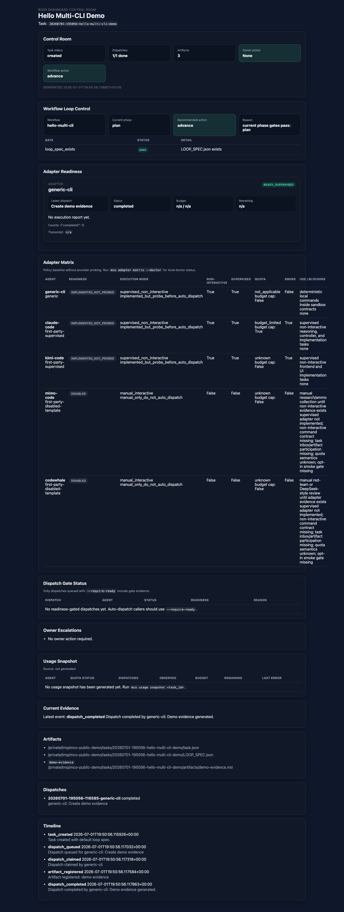
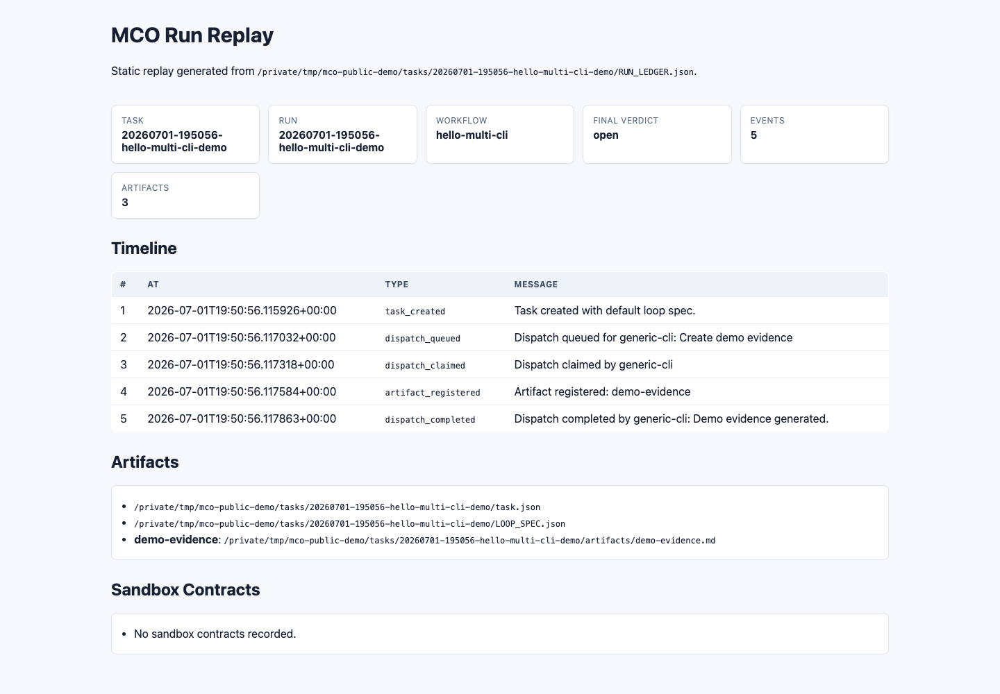
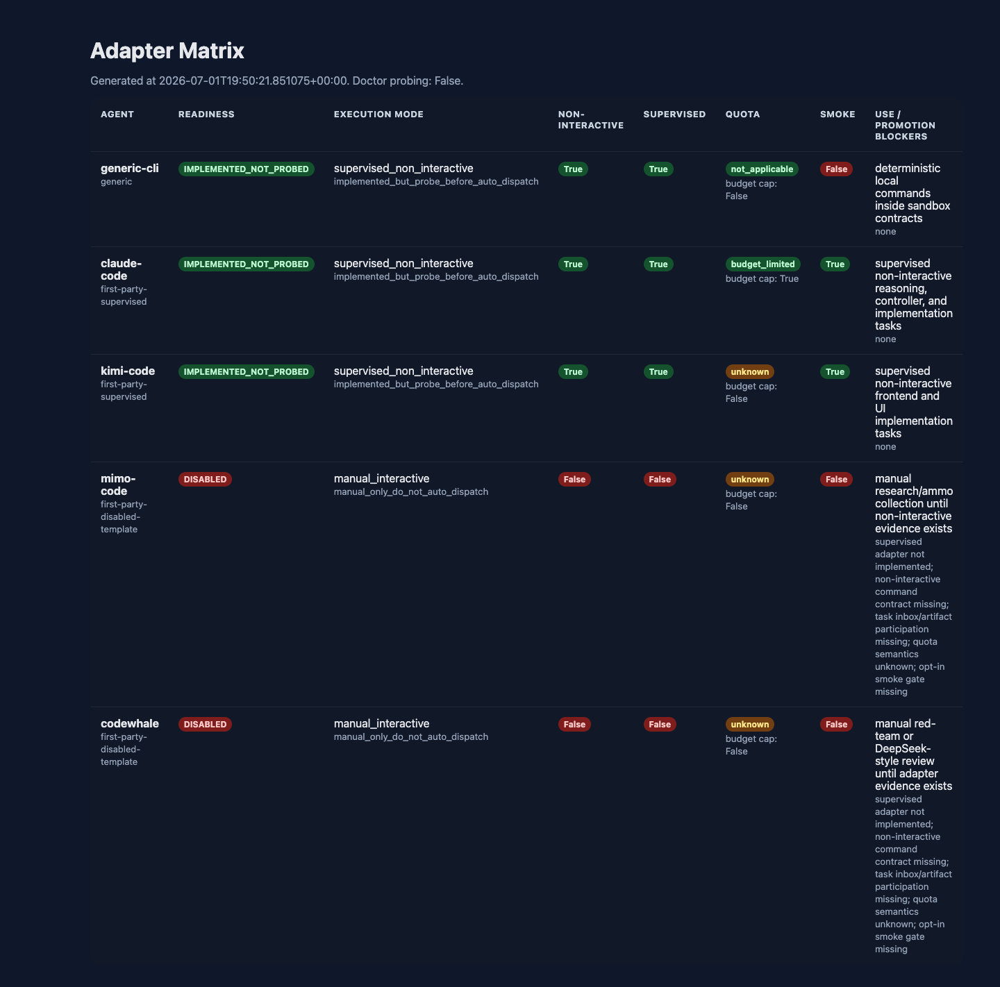

# Demo Story v5.1

This demo story explains Multi-CLI Orchestrator through one concrete arc:

> Stop copy-pasting prompts across AI coding CLI windows. Put the task into a local control plane, let the workflow expose what should happen next, and verify the result through dashboard, replay, and adapter evidence.

## Audience

- Developers who already use more than one AI coding CLI.
- Team leads who need evidence before accepting AI-generated work.
- Contributors who want to understand how adapters become safe enough to use.

## What This Demo Shows

| Moment | What the viewer learns |
| --- | --- |
| Task workspace | A task is a durable local object, not a chat transcript. |
| Workflow loop control | The system can explain whether to advance, wait, escalate, or complete. |
| Dashboard | A human can see dispatches, adapter posture, artifacts, and owner action. |
| Replay | The run can be reconstructed after the conversation is gone. |
| Adapter kit | New CLI integrations start disabled and evidence-first. |

## Talk Track

### 1. Start from the real pain

When a task becomes complex, multiple AI CLIs are useful but hard to coordinate. One may plan, another may implement, another may review. Without a control plane, the user becomes the message bus: copying prompts, checking which window is done, and guessing whether the output is safe to accept.

Multi-CLI Orchestrator changes the unit of work from "a prompt in a window" to "a task workspace with gates and evidence."

### 2. Create a local workflow

```bash
mco demo walkthrough --workspace /tmp/mco-public-demo --output-dir /tmp/mco-public-demo-output
```

The walkthrough creates:

- a demo task,
- task-local `LOOP_SPEC.json` and `RUN_LEDGER.json`,
- a dashboard,
- a replay transcript and replay HTML,
- a disabled adapter kit for a fake CLI.

### 3. Show the boss dashboard



The dashboard answers the operational questions:

- Who is working?
- Which dispatches are done?
- Which artifacts exist?
- What is the recommended workflow action?
- Are adapters ready, disabled, manual-only, or blocked?
- Is owner action required?

The key point is not that the dashboard is visually fancy. The point is that the automation is visible and bounded.

### 4. Show run replay



Replay proves that the task has a durable history:

- task created,
- dispatch queued,
- dispatch claimed,
- artifact registered,
- dispatch completed.

This is the "evidence before claims" principle in a form that survives beyond the chat context.

### 5. Show adapter posture



The adapter matrix is deliberately conservative:

- implemented adapters still need readiness checks before auto-dispatch;
- disabled adapters do not receive automatic inbox files;
- manual-only CLIs are visible instead of silently assumed safe;
- future adapters must prove sandbox, quota, smoke, and evidence behavior.

This is what keeps multi-CLI automation from turning into uncontrolled provider execution.

## Commands to Reproduce

```bash
git clone https://github.com/god0618-cloud/multi-cli-orchestrator.git
cd multi-cli-orchestrator
python -m venv .venv
source .venv/bin/activate
pip install -e .

mco demo walkthrough \
  --workspace /tmp/mco-public-demo \
  --output-dir /tmp/mco-public-demo-output

cat /tmp/mco-public-demo-output/README.md
open /tmp/mco-public-demo-output/RUN_REPLAY.html
```

Generate an adapter matrix:

```bash
mco adapter matrix \
  --output /tmp/adapter-matrix.json \
  --html /tmp/adapter-matrix.html
open /tmp/adapter-matrix.html
```

## Demo Success Criteria

| Gate | Pass condition |
| --- | --- |
| Fresh clone | The commands run without private local paths or business data. |
| Dashboard | The viewer can see workflow action, adapter readiness, artifacts, and timeline. |
| Replay | The viewer can reconstruct the run from `RUN_LEDGER.json`. |
| Adapter kit | The generated adapter kit starts disabled and has a local contract test. |
| Safety story | The viewer understands why not every CLI is auto-dispatched. |

## One-Minute Summary

Multi-CLI Orchestrator does not try to be the smartest agent in the room. It makes a room for multiple AI coding CLIs to work under shared state, gates, artifacts, replay, and visible escalation. The demo is intentionally small because the claim is specific: coordination should be observable before it becomes powerful.

