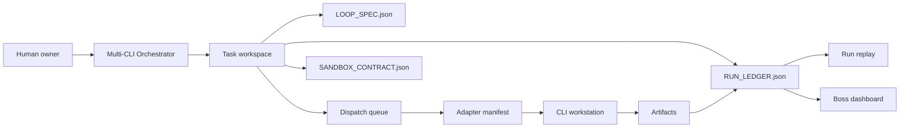
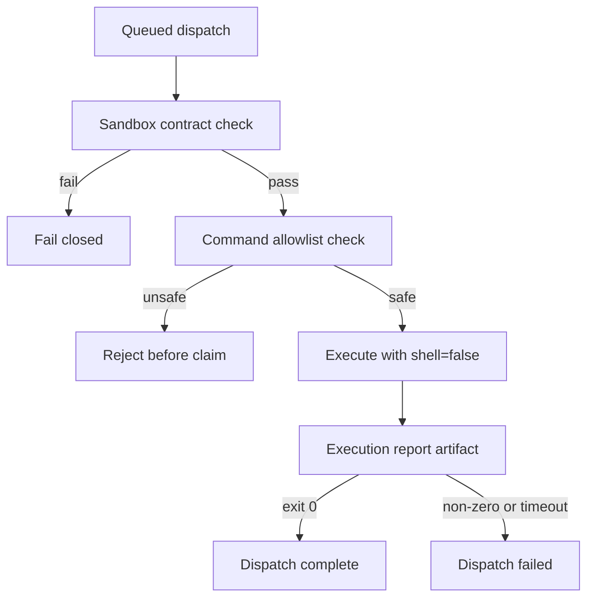
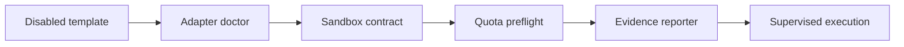

# Diagrams

## Control Plane

Source asset: `docs/assets/control-plane.mmd`

## Execution Gate

Source asset: `docs/assets/execution-gate.mmd`

## Adapter Maturity

Source asset: `docs/assets/adapter-maturity.mmd`

