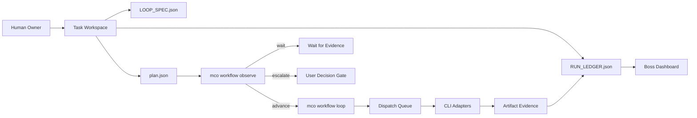

# Multi-CLI Orchestrator 项目设计说明 v5.0

当前版本：`v5.0.0`  
项目定位：本地优先的多 AI Coding CLI 协作控制平面  
开源地址：https://github.com/god0618-cloud/multi-cli-orchestrator

## 1. 项目一句话

Multi-CLI Orchestrator 把多个 AI Coding CLI 组织成可监管、可审计、可回放、可停止的小团队。

它不是替代任意 CLI 的大一统 agent，而是一个控制面：负责任务状态、adapter 能力、sandbox 边界、workflow gate、artifact evidence、run ledger、dashboard 和 replay。

## 2. 设计目标

| 目标 | 说明 |
| --- | --- |
| 多 CLI 协作 | 支持 Codex、Claude Code、Kimi Code、Mimo Code、CodeWhale 等以不同成熟度接入 |
| 本地优先 | 任务状态、证据、回放先写在本地 workspace |
| 证据优先 | 结果必须落为 artifact / ledger event / report |
| 门禁推进 | workflow phase 不能只靠 prompt 约定推进 |
| 可停止 | 缺证据 wait，失败 escalate，完成 complete |
| 老板视角 | dashboard 直观看见当前谁在干、为什么停、下一步是什么 |

## 3. v5.0 核心能力

### 3.1 workflow observe

```bash
mco workflow observe <task_id>
```

返回机器可读推荐动作：

| 动作 | 含义 |
| --- | --- |
| `advance` | 当前 phase gate 满足，可以推进 |
| `wait` | 缺证据或 dispatch 未结束 |
| `escalate` | 失败、阻塞或需要用户决策 |
| `complete` | workflow 已完成 |

### 3.2 workflow loop

```bash
mco workflow loop <task_id> --max-steps 1
```

这是一个有硬上限的 observe/advance 循环。它不执行无限 daemon，不绕过 gate，不直接启动未证明安全的外部 CLI。

### 3.3 strict-self-closing 模板

```text
plan -> execute -> verify -> close
```

| 阶段 | 门禁 |
| --- | --- |
| plan | `LOOP_SPEC.json` exists |
| execute | implementation artifact + dispatch terminal + no failed/blocked |
| verify | verification artifact + verification event + dashboard |
| close | close artifact + clean dispatch state |

### 3.4 Adapter Matrix

v5.0 显性化：

- `execution_mode`
- `automation_posture`
- `recommended_use`
- quota status
- smoke gate
- promotion blockers

这样可以明确：Claude Code / Kimi Code 已有 supervised non-interactive adapter；Mimo / CodeWhale 目前是 manual-only，不自动派发。

## 4. 系统结构



## 5. 安全边界

v5.0 明确不做：

- 无约束真实并发 provider execution；
- 未证明 adapter 的自动派发；
- 无限循环；
- 静默绕过 user decision gate；
- 直接写入 native CLI memory / stable KB；
- 任意 shell 执行。

## 6. 验证证据

```text
41 tests OK
compileall OK
release check PASS=27 WARN=0 FAIL=0
audit PASS=101 WARN=0 FAIL=0
strict-self-closing CLI smoke -> recommended_action=complete
GitHub CI main -> success
GitHub CI v5.0.0 tag -> success
```

Release：

https://github.com/god0618-cloud/multi-cli-orchestrator/releases/tag/v5.0.0

## 7. 适合演示的主线

1. 创建 workspace。
2. 创建 `strict-self-closing` 任务。
3. 执行 `workflow observe`，展示推荐动作。
4. 补 artifact，执行 `workflow loop`。
5. 打开 dashboard，展示 Workflow Loop Control。
6. 展示 Adapter Matrix，说明哪些 CLI 能自动，哪些只能手动。
7. 打开 release notes 和 CI，证明不是 demo 口径。

## 8. 项目价值

Multi-CLI Orchestrator 的价值不是让 agent 更“猛”，而是让复杂 AI 协作更可控。

当 AI Coding CLI 越来越多，真正稀缺的不是又一个模型入口，而是一个能够把状态、能力、边界、证据、成本和决策组织起来的控制面。
