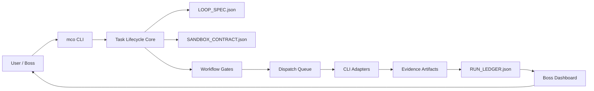

# Multi-CLI Orchestrator v5.0 完整项目说明

> 一个本地优先的 AI Coding CLI 协作控制平面。它把 Codex、Claude Code、Kimi Code、Mimo Code、CodeWhale/DeepSeek 等 CLI 当成可监管的“工位”，用任务状态、工作流门禁、证据产物、运行回放和老板视角控制台组织起来。

- GitHub: https://github.com/god0618-cloud/multi-cli-orchestrator
- v5.0 Release: https://github.com/god0618-cloud/multi-cli-orchestrator/releases/tag/v5.0.0
- 许可证: Apache-2.0
- 当前状态: v5.0 strict-gate self-closing loop

---

## 1. 项目一句话

Multi-CLI Orchestrator 不是新的大一统 Agent，也不是替代某个 AI Coding CLI 的壳。它是一个本地控制平面，让多个真实 CLI 在同一个任务工作区里分工、交接、产出证据、接受门禁、可被审计、可被回放。

它解决的是复杂 AI 编程任务里的一个真实问题：

> 当你已经同时使用多个 AI Coding CLI 时，怎么避免协作退化成“人在不同窗口复制粘贴 prompt”，并且怎么知道它们有没有越权、跑偏、卡住、浪费额度、产物不可验收？

---

## 2. 为什么需要它

现在很多开发者和团队不是只用一个 AI 工具。常见组合可能是：

| 工具 | 常见优势 |
| --- | --- |
| Codex | 本地工程执行、验证、代码修改、工具链联动 |
| Claude Code | 长上下文规划、需求拆解、文档组织、项目总控 |
| Kimi Code | 前端实现、中文语境理解、页面快速落地 |
| Mimo Code | 调研、素材弹药、参考案例收集 |
| CodeWhale/DeepSeek | 红队审查、交叉验证、另一模型视角 |

这些工具各自很强，但放到复杂任务里会出现一组共性问题：

| 问题 | 没有控制平面时的表现 |
| --- | --- |
| 状态分散 | 每个 CLI 窗口都知道一部分，但没有共同任务事实 |
| 交接靠人 | 用户复制 prompt、贴文件路径、问“下一步做什么” |
| 自动化不透明 | 工具在跑，但人不知道为什么继续、为什么停止 |
| 门禁靠自觉 | “请自检”写在 prompt 里，但缺少机器可判定条件 |
| 证据不可回放 | 最终说“完成了”，但过程、产物、决策链难复盘 |
| 权限和额度不清 | 哪些 CLI 能自动跑、哪些只能手动，缺少显性判断 |
| 记忆污染风险 | 普通会话、native memory、稳定知识库之间边界不清 |

Multi-CLI Orchestrator 的核心判断是：多 CLI 协作不是多开几个窗口，而是要有一个外部、可审计、可停止的控制面。

---

## 3. 设计目标

项目遵循五个设计目标：

| 目标 | 含义 |
| --- | --- |
| 本地优先 | 默认在本机任务工作区内运行，不依赖云端服务保存任务状态 |
| CLI 中立 | 不绑定单一模型或单一 CLI，让 CLI 以 adapter 方式接入 |
| 证据优先 | 任何完成声明都应该能追溯到 artifact、ledger、报告、测试或截图 |
| 门禁推进 | 工作流阶段不是靠“感觉完成”，而是靠 gate 判定 |
| 人类可监管 | 自动化可以推进，但必须能看见、能停下、能升级到用户决策 |

一句话概括：

> 让 AI CLI 像团队成员一样工作，但让任务状态、交接、门禁、审计和停止条件由系统托管。

---

## 4. 核心概念

### 4.1 CLI Workstation

CLI Workstation 指一个外部 AI Coding CLI。它可以接收任务、执行有限工作、输出报告或产物，但必须被 adapter 能力、sandbox contract、timeout、quota 和 evidence gate 管住。

### 4.2 Task Workspace

每个任务都有独立工作区，用来保存任务事实，而不是把事实散落在聊天上下文里。

典型文件包括：

| 文件 | 作用 |
| --- | --- |
| `task.json` | 当前任务元信息 |
| `LOOP_SPEC.json` | 目标、停止条件、验收规则 |
| `plan.json` | 阶段计划和状态 |
| `RUN_LEDGER.json` | 可回放运行账本 |
| `dispatch/` | agent inbox、dispatch 状态 |
| `artifacts/` | 报告、截图、测试输出、执行证据 |
| `USAGE_SNAPSHOT.json` | 使用量和额度证据汇总 |

### 4.3 Loop Spec

`LOOP_SPEC.json` 是防止“无限跑”的核心。它定义任务目标、边界、停止条件、证据类型和升级条件。

### 4.4 Sandbox Contract

`SANDBOX_CONTRACT.json` 定义 worker 可以读写哪里、是否允许外部网络、是否允许真实执行、端口范围、凭据边界和必须产出的证据。

### 4.5 Run Ledger

`RUN_LEDGER.json` 记录发生过什么：任务创建、dispatch、claim、completion、artifact、gate 判断、人工决策和最终 verdict。它的目标是 replay before memory：先有可回放事实，再谈长期记忆沉淀。

### 4.6 Workflow Gate

Workflow Gate 是机器可判定的阶段推进条件。例如：

- `file_exists:<relative-path>`
- `artifact_registered:<label-or-filename>`
- `ledger_event:<event-type>`
- `user_decision:<decision-id>`
- `all_dispatches_terminal`
- `no_failed_dispatches`
- `no_blocked_dispatches`
- `dispatch_status_count:<status>:<minimum>`

---

## 5. 系统架构



### 架构分层

| 层 | 负责什么 |
| --- | --- |
| CLI 层 | `mco` 命令入口、状态查询、任务创建、workflow 操作 |
| Task Core | 创建任务、登记事件、管理 artifact、读取任务事实 |
| Workflow Core | 计算当前 phase、评估 gate、给出下一步建议 |
| Dispatch Core | queue、claim、complete、wave、execute |
| Adapter Layer | 描述并执行不同 CLI 的能力边界 |
| Evidence Layer | 保存报告、日志、截图、执行结果、usage snapshot |
| Dashboard | 面向人的控制台，显示状态、门禁、证据和风险 |

---

## 6. v5.0 已实现能力

### 6.1 任务和证据

- `mco init`
- `mco task create/list/status/event`
- `mco artifact register`
- `mco audit`
- `mco release check`

### 6.2 Dispatch 和 Worker

- `mco dispatch queue/list/claim/complete`
- `mco dispatch wave`
- `mco dispatch execute --dry-run`
- `mco dispatch execute --command-json`
- `mco dispatch execute --agent claude-code --prompt-file`
- `mco dispatch execute --agent kimi-code --prompt-file`

### 6.3 Adapter

- `mco adapter capabilities`
- `mco adapter doctor`
- `mco adapter matrix`
- `mco adapter scaffold`
- `mco adapter validate-kit`
- `mco adapter smoke`

当前 adapter 姿态：

| CLI | v5.0 姿态 |
| --- | --- |
| generic-cli | 已实现，自动派发前建议 doctor/probe |
| Claude Code | supervised non-interactive adapter 已实现 |
| Kimi Code | supervised non-interactive adapter 已实现 |
| Mimo Code | manual only，不自动派发 |
| CodeWhale/DeepSeek | manual only，不自动派发 |

### 6.4 Workflow

- `mco orchestrate-start`
- `mco workflow status`
- `mco workflow advance`
- `mco workflow observe`
- `mco workflow loop`

### 6.5 可视化和复盘

- `mco status`
- `mco monitor`
- `mco dashboard`
- `mco usage snapshot`
- `mco run replay`
- `mco demo walkthrough`

---

## 7. v5.0 的关键突破：严格门禁自闭环

v5.0 的核心变化是从“能派发多个 worker”进一步走到“能在严格门禁下自我推进”。

新增命令：

```bash
mco workflow observe <task_id>
mco workflow loop <task_id> --max-steps 1
```

`observe` 会给出机器可读建议：

| 推荐动作 | 含义 |
| --- | --- |
| `advance` | 当前阶段 gate 已通过，可以推进 |
| `wait` | 证据不足、dispatch 未完成或条件未满足 |
| `escalate` | 出现失败、阻塞或用户决策门 |
| `complete` | 工作流已经闭环完成 |

`loop` 是有上限的 observe/advance 循环。它不是 daemon，不会无限跑；它只在 gate 已经通过时推进，否则停止并给出原因。

### strict-self-closing 模板

```bash
mco orchestrate-start "Strict product task" \
  --template strict-self-closing \
  --workspace .mco-workspace
```

模板阶段：

```text
plan -> execute -> verify -> close
```

阶段门禁：

| 阶段 | 必要证据 |
| --- | --- |
| plan | `LOOP_SPEC.json` 存在 |
| execute | `implementation-report.md` 已登记；dispatch 全部 terminal；无 failed/blocked |
| verify | `verification-report.md` 已登记；有 verification ledger event；dashboard 存在 |
| close | `close-report.md` 已登记；无 failed/blocked |

这让“自动继续”变成可解释的状态机，而不是一句 prompt 里的祈祷。

---

## 8. 老板视角控制台

Dashboard 的目标不是炫技，而是回答几个朴素问题：

- 现在谁在干活？
- 哪些 dispatch 已完成、失败或阻塞？
- 当前 workflow phase 是什么？
- 系统建议继续、等待、升级还是完成？
- 推荐原因是什么？
- 哪些 gate 通过了，哪些没通过？
- 有没有额度、权限、adapter readiness 风险？
- 已经有哪些 artifact 可以验收？

v5.0 Dashboard 增加了 Workflow Loop Control 面板，让自动化不是黑盒。

---

## 9. 安全边界

Multi-CLI Orchestrator 的安全策略是保守优先：

| 边界 | v5.0 策略 |
| --- | --- |
| 任意 shell | 不支持无约束任意 shell |
| generic execution | 只允许窄范围安全命令，如 `echo` 和 print-only `python -c` |
| Claude Code | `claude --print`、禁用 tools、禁用 session persistence、timeout、output limit、budget cap |
| Kimi Code | `kimi --prompt`、timeout、output limit、transcript artifact |
| adapter auto-dispatch | 建议使用 `--require-ready` |
| manual-only CLI | 不因“能打开”就进入自动派发链路 |
| native memory / stable KB | 不默认写入，避免污染个人或团队知识库 |
| workflow loop | 必须有 `--max-steps`，遇到缺证据、失败、阻塞、用户决策门即停 |

核心原则：

> 自动化不是越多越好，而是证明过边界的自动化才进入闭环。

---

## 10. 典型使用流程

### 10.1 安装

```bash
git clone https://github.com/god0618-cloud/multi-cli-orchestrator.git
cd multi-cli-orchestrator
python -m venv .venv
source .venv/bin/activate
pip install -e .
```

### 10.2 初始化

```bash
mco init --workspace .mco-workspace
mco doctor --workspace .mco-workspace
```

### 10.3 创建自闭环任务

```bash
mco orchestrate-start "Strict product task" \
  --template strict-self-closing \
  --workspace .mco-workspace
```

### 10.4 观察和推进

```bash
mco workflow observe <task_id> --workspace .mco-workspace
mco workflow loop <task_id> --workspace .mco-workspace --max-steps 1
```

### 10.5 查看控制台

```bash
mco dashboard <task_id> --workspace .mco-workspace
```

### 10.6 回放

```bash
mco run replay <path-to-RUN_LEDGER.json>
mco run replay <path-to-RUN_LEDGER.json> --html replay.html
```

---

## 11. 和普通 subagent 的区别

| 维度 | 普通 subagent | Multi-CLI Orchestrator |
| --- | --- | --- |
| 执行边界 | 同一框架内部 | 多个真实 CLI 工位 |
| 模型多样性 | 受同一 runtime 限制 | 可以接入不同 CLI 和模型体系 |
| 状态保存 | 常在上下文里 | 任务工作区文件 |
| 交接方式 | prompt 内部交接 | dispatch queue + artifact |
| 验收依据 | 回答描述为主 | gate + ledger + artifact |
| 可视化 | 通常弱 | boss dashboard |
| 失败处理 | 主 agent 判断 | wait / escalate / blocked evidence |
| 复盘能力 | 依赖聊天记录 | run replay |

两者并不冲突。subagent 适合同一 runtime 内的轻量拆分；Multi-CLI Orchestrator 适合跨 CLI、跨模型、跨工具链、需要审计和证据的复杂任务。

---

## 12. 适用场景

| 场景 | 为什么适合 |
| --- | --- |
| 多 CLI 编程工作流 | 可以把不同 CLI 的优势组织起来，而不是人工搬运 |
| 前后端并行开发 | 前端、后端、红队、文档可以各自写入任务证据 |
| 产品需求到工程交付 | PRD、API、实现、E2E、验收、复盘都有 gate |
| AI 生成内容流水线 | 编剧、分镜、提示词、I2V、后期、审核可形成证据链 |
| 本地知识库治理 | memory、candidate delta、stable KB 可以分层管理 |
| 开源项目维护 | adapter 贡献、CI、release check、audit 都有标准入口 |

---

## 13. 当前不适合什么

| 不适合 | 原因 |
| --- | --- |
| 想要完全托管的云端 SaaS | 当前是本地优先 CLI 项目 |
| 想要无约束 autonomous agent | 项目故意保守，不鼓励无限自动跑 |
| 想让所有 CLI 立即自动执行 | 未通过 adapter readiness 的 CLI 保持 manual only |
| 需要生产级 secrets manager | v5.0 不承担生产密钥治理 |
| 需要复杂多分支 merge 冲突解决 | 当前强调任务证据和门禁，复杂 merge 仍需人或上层策略 |

---

## 14. 验证状态

v5.0 发布前验证：

```text
41 tests OK
compileall OK
release check PASS=27 WARN=0 FAIL=0
audit PASS=101 WARN=0 FAIL=0
strict-self-closing CLI smoke -> recommended_action=complete
GitHub CI main -> success
GitHub CI v5.0.0 tag -> success
```

外发材料更新后：

```text
GitHub CI main -> success
HTML parser check -> pass
Feishu doc dry-run -> pass
Feishu doc fetch verification -> pass
```

---

## 15. 路线图

### v5.x

- 更细的 workflow template 库
- 更明确的 user decision gate 交互
- 更强的 dashboard 过滤和摘要
- adapter smoke 结果对比
- 更完整的贡献者 adapter kit 示例

### v6.0 方向

- 更成熟的非交互式 CLI adapter 生命周期
- 更强的 quota/cost/cancel/timeout 策略
- 更清晰的并发 worker 冲突治理
- 可选的长期记忆 promotion gate
- 更完整的多项目 workspace 管理

### v7.0 方向

- 从本地 CLI 控制面走向可复用 Agent OS 基础设施
- 多端控制台
- 更丰富的组织级治理策略
- 可选团队协作和权限模型

---

## 16. 贡献者如何参与

可以从这些方向参与：

| 方向 | 适合谁 |
| --- | --- |
| 新 CLI adapter | 正在使用其他 AI Coding CLI 的开发者 |
| Workflow template | 有复杂工程流程、内容流水线或审查流程的人 |
| Dashboard 改进 | 前端、可视化、运维体验方向 |
| Safety gate | 关注权限、沙箱、审计、安全的人 |
| Docs / Examples | 希望降低上手门槛的人 |

推荐入口：

- `docs/adapter-contributor-guide.md`
- `docs/adapter-templates.md`
- `docs/command-reference.md`
- `docs/quickstart.md`
- `.github/ISSUE_TEMPLATE/adapter-request.yml`

---

## 17. 项目定位总结

Multi-CLI Orchestrator 的价值不是“让 AI 更像人”，而是“让 AI CLI 的协作更像工程”。

它把复杂任务拆成可见、可控、可验收的环节：

```text
目标 -> 计划 -> 派发 -> 执行 -> 证据 -> 验证 -> 门禁 -> 回放 -> 复盘
```

如果你已经在使用多个 AI Coding CLI，那么它提供的是一个缺失的中间层：

- 不接管你的 CLI；
- 不污染你的记忆；
- 不承诺魔法；
- 只把协作、门禁、证据和停止条件变成工程对象。

这就是 v5.0 的核心：严格门禁下的多 CLI 自闭环。

